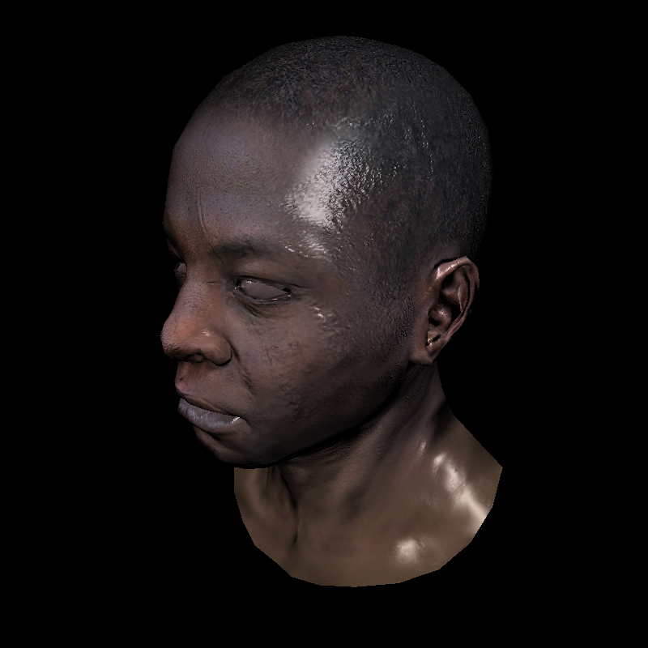
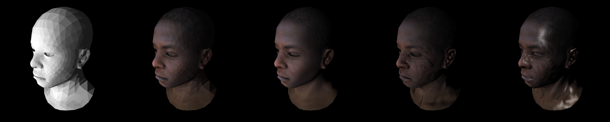

# Software Renderer

Loosely based off of, and using object/material assets from [ssloy/tinyrenderer](https://github.com/ssloy/tinyrenderer).

## Examples

### Initial - Texturing - Phong Shading - Normal Mapping - Specular Highlights 
